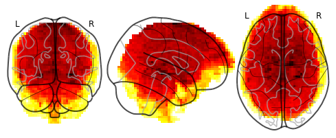

# Haxby Registration 
The Python code registers Haxby _[1]_ to MNI152 _[2] & [3]_ (~ 3H/subject).

## Required Packages
_numpy, nibabel, nilearn, dipy, tqdm_


```sh
pip install numpy nibabel nilearn dipy tqdm
```

## Before Registration
Example of a Haxby image in the MNI152 template.

<p align="center">
  
</p>

Code to print the above image:
```sh
#Import nilearn
from nilearn import datasets 
from nilearn.image.image import mean_img
from nilearn.plotting import plot_glass_brain

#Second subject is choosen by default
haxby_dataset = datasets.fetch_haxby()

# Compute the mean EPI: we do the mean along the axis 3, which is time
func_filename = haxby_dataset.func[0]
mean_haxby = mean_img(func_filename)

plotting.plot_glass_brain(mean_haxby)

```
## Run code

```sh
python haxby-registration.py
```

## References

[1]. Haxby, J., Gobbini, M., Furey, M., Ishai, A., Schouten, J., and Pietrini, P. (2001). Distributed and overlapping representations of faces and objects in ventral temporal cortex. Science 293, 2425-2430.

[2]. VS Fonov, AC Evans, K Botteron, CR Almli, RC McKinstry, DL Collins and BDCG, Unbiased average age-appropriate atlases for pediatric studies, NeuroImage, Volume 54, Issue 1, January 2011, ISSN 1053-8119, DOI: 10.1016/j.neuroimage.2010.07.033

[3]. VS Fonov, AC Evans, RC McKinstry, CR Almli and DL Collins, Unbiased nonlinear average age-appropriate brain templates from birth to adulthood, NeuroImage, Volume 47, Supplement 1, July 2009, Page S102 Organization for Human Brain Mapping 2009 Annual Meeting, DOI: 10.1016/S1053-8119(09)70884-5

